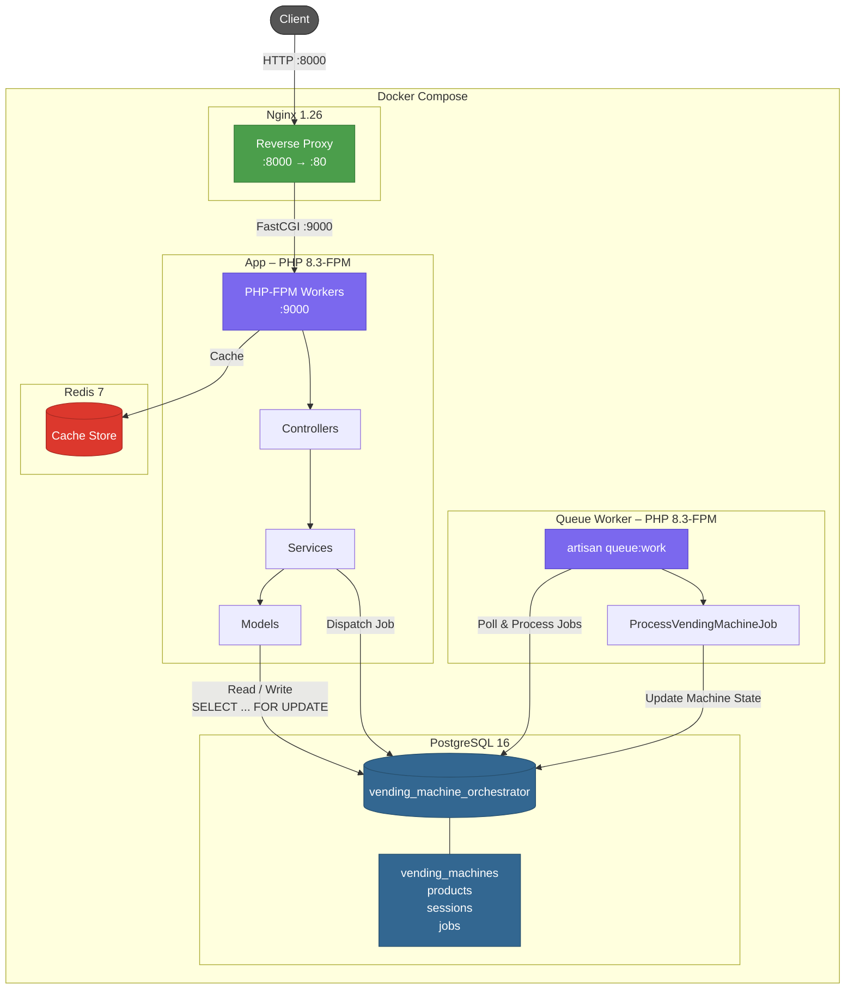
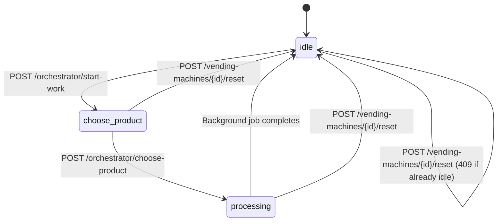

# Architecture

## Overview

The system is a vending machine orchestrator that manages multiple vending machines sharing a common product inventory. Each vending machine is modeled as a state machine. An orchestrator layer coordinates machine selection and product dispensing with concurrency-safe inventory access.

## System Architecture



## Entities

### VendingMachine

Represents a physical vending machine. Tracks its current operational state and cumulative usage count.

Fields: `id`, `name`, `status`, `usage_count`, `created_at`, `updated_at`

### Product

Represents a product type in the shared inventory. The `stock` field is the single source of truth for available quantity across all machines.

Fields: `id`, `name`, `stock`, `created_at`, `updated_at`

## State Machine

Each vending machine transitions through three states:



- `idle`: Machine is available for selection.
- `choose_product`: Machine has been selected by the orchestrator and is waiting for a product choice.
- `processing`: Machine is dispensing a product. A background job simulates the delivery delay and returns the machine to idle.

A manual **reset** endpoint (`POST /api/vending-machines/{id}/reset`) can force any machine back to `idle` state, regardless of its current state. This is useful for administrative recovery of stuck machines.

## Request Flow

```mermaid
sequenceDiagram
    participant C as Client
    participant N as Nginx
    participant A as App (PHP-FPM)
    participant P as PostgreSQL
    participant Q as Queue Worker

    Note over C,Q: Purchase Flow

    C->>N: POST /api/orchestrator/start-work
    N->>A: FastCGI forward
    A->>P: BEGIN; SELECT ... FOR UPDATE (idle machines)
    P-->>A: Least-used idle machine
    A->>P: UPDATE status → choose_product; COMMIT
    A-->>N: 200 { machine }
    N-->>C: Response

    C->>N: POST /api/orchestrator/choose-product
    N->>A: FastCGI forward
    A->>P: BEGIN; LOCK machine + product rows
    A->>P: Decrement stock, set status → processing
    A->>P: INSERT job into jobs table; COMMIT
    A-->>N: 200 { machine, product }
    N-->>C: Response

    Q->>P: Poll jobs table
    P-->>Q: ProcessVendingMachineJob
    Note over Q: Simulate delivery delay
    Q->>P: UPDATE status → idle, increment usage_count
    Q->>P: DELETE job
```

## Machine Selection Algorithm

When `start_work` is called, the orchestrator selects the idle machine with the lowest `usage_count`. This ensures fair distribution of workload. If no idle machine exists, the request is rejected with HTTP 409.

The selection query acquires a row-level lock to prevent race conditions when multiple requests arrive concurrently.

## Inventory Concurrency Control

Product stock is a shared resource accessed by all machines. The `choose_product` operation runs inside a database transaction with pessimistic locking (`SELECT ... FOR UPDATE`) on the product row. This serializes concurrent stock modifications and prevents overselling.

PostgreSQL provides row-level MVCC locking, allowing high write concurrency — only rows involved in a transaction are locked, while other rows remain freely accessible.

## Background Processing

After stock is decremented, the machine enters `processing` state and a `ProcessVendingMachineJob` is dispatched to the queue. The job sleeps for a configurable duration (simulating physical delivery), then sets the machine back to `idle` and increments its `usage_count`.

The queue uses the `database` driver backed by PostgreSQL.

## Layered Architecture

- **Controllers**: Handle HTTP concerns (request/response). Delegate business logic to services.
- **Form Requests**: Validate and sanitize input before it reaches controllers.
- **Services**: Contain business logic (machine selection, purchase flow). Interact with models and dispatch jobs.
- **Models**: Eloquent models with attribute casting. Represent database entities.
- **Jobs**: Asynchronous work units processed by the queue worker.

## Infrastructure

- **Web Server**: Nginx 1.26 reverse proxy forwarding FastCGI requests to PHP-FPM.
- **Runtime**: PHP 8.3-FPM (multi-process, concurrent request handling).
- **Database**: PostgreSQL 16 with row-level locking.
- **Cache**: Redis 7.
- **Queue**: Laravel database queue driver (PostgreSQL-backed).
- **Containerization**: Docker Compose with five services:

| Service | Image / Build | Role |
|---------|---------------|------|
| `app` | Custom (PHP 8.3-FPM) | Application server |
| `nginx` | nginx:1.26-alpine | Reverse proxy on port 8000 |
| `queue` | Custom (PHP 8.3-FPM) | Background queue worker |
| `postgres` | postgres:16-alpine | Primary database |
| `redis` | redis:7-alpine | Caching layer |
